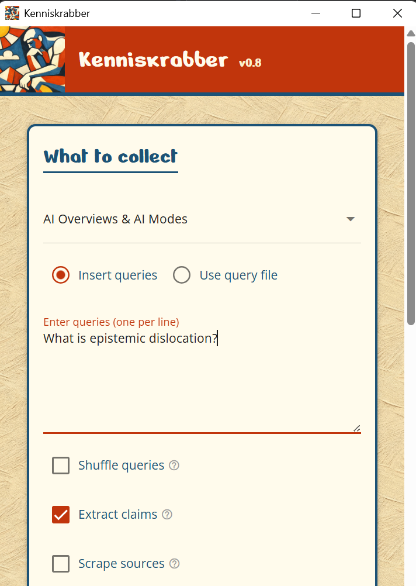

# 🤔Kenniskrabber
<p align="center">
  
</p>
Kenniskrabber is a semi-automated tool to collect and analyze data from Google AI Overviews and AI Mode answers.

While it does not circumvent any CAPTCHAs, Kenniskrabber does speed up the [means to observe](https://policyreview.info/articles/analysis/towards-platform-observability) AI responses in search. 

## What can I collect?
1. AI Mode and AI Overview responses as a JSON and CSV. This includes
   - The text of the response.
   - The time of the query.
   - The sources, including their title, description, domain name, and URL.
   - The 'main answer' of the AI response (highlighted, bold text).
   - All the 'claims' (highlighted texts) in the AI answer and which sources these are linked to.
2. Full-page screenshots
3. HTML snapshot and screenshots of the Google SERP and AI Mode answers
4. HTML snapshot and screenshots of the linked-to sources.

## Installation
### As a Python script
You can run Kenniskrabber as a NiceGUI app through Python. Create and activate a [virtual environment](https://www.w3schools.com/python/python_virtualenv.asp) and run:
```bash
pip install -r requirements.txt
```

To start: 
```bash
python main.py
```

### As an app

#### macOS
1. Install and open the `.dmg` file from [here](https://github.com/digitalmethodsinitiative/kenniskrabber/releases/tag/v0.8). MacOS will say that the app is from an unidentified developer.
2. Go to System settings (Apple icon on the top left -> `System settings`). 
3. Go to `Privacy & Security` and scroll down to `Security`.
4. Click `Open Anyway` for Kenniskrabber.
5. Open Kenniskrabber and start a test scrape (insert a query and press `Prepare browser`).
6. macOS will likely say that Kenniskrabber is not allowed to update apps. Click Allow on the pop-up and restart Kenniskrabber.
7. Kenniskrabber should now have all the privileges to work.

#### Windows (11)
1. In the Windows settings, go to `Advanced` -> `Developer mode` and turn it on.
2. Install and open the Kenniskrabber `.exe` file from [here](https://github.com/digitalmethodsinitiative/kenniskrabber/releases/tag/v0.8). macOS will say that the app is from an unidentified developer.
3. You will see a pop-up saying 'Windows protected your PC'. Click `More info` and then `Run anyway`.
4. Run through the installer.
5. Open Kenniskrabber. The first startup may have some troubles with the browser. If so, close Kenniskrabber and restart it.

## Running a scrape
1. In the top dropdown, choose whether you want to scrape AI Overviews, AI Mode, or both.
2. Insert search queries. You can either:
   - Use `Insert queries` to paste newline-separated queries.
   - Use `Use query file` to point to an existing csv file with queries. Kenniskrabber will look for queries under a `query` column or either use the first column values. Existing columns will be added to the Kenniskrabber .csv and .json output file. This allowing you to cross-reference query categorizations and AI outputs.
3. Choose whether you want to shuffle queries, extract claims (highlighted answers in the AI response), and the sources that are linked-to in each of the AI responses.
4. Set an output location (default: `Documents/Kenniskrabber/scrapes/scrape_YYYY-MM-DD_HH-SS/`).
   - If you choose an existing folder, Kenniskrabber will append to the existing scrape and skip the queries it has already processed. Useful if things crash!
5. Choose your scrape settings
   - Use a Firefox profile if you want to use Google Search with a specific user history.
   - You can change `Top level domain` to navigate to a specific Google domain (e.g., `google.de`).
   - `Offset` lets you skip the first n queries in your list.
   - `Throttled text` is used to recognize when an AI response gets throttled. This happen at various moments (in our experience, after a few hundred queries). If you use Google Search in another language than English, change accordingly. 
   - If Kenniskrabber's default CSS selectors are not working, you can change them under `CSS selectors`.
   - This is also the moment to potentially start a VPN if geolocation is of the essence.
6. Press `Prepare browser` to open Firefox. Kenniskrabber will open a browser window where you have to solve a CAPTCHA. Here you can also log in to a Google account, add extensions, or adjust anything else browser-related.
7. Press `Start scrape` to start the scrape. Kenniskrabber will now go through your queries and collect the data. You can stop the scrape at any time by pressing `Stop scrape`. If you do so, Kenniskrabber will save the data it has collected so far.
8. When the scrape is finished, you can find the output in the output folder you specified. The output will be a CSV and JSON file with all the data, as well as screenshots and HTML snapshots of the Google SERP, AI Mode answers, and linked-to sources.

## Help, things broke
Don't panic, that happens! You can edit the relevant CSS selectors in the Kenniskrabber interface yourself. Please also submit a GitHub issue to notify the developers.

## Credits & license
Kenniskrabber is created by [Sal Hagen](https://salhagen.nl) as part of the [Deep Culture](https://deep-culture.org) project and [Digital Methods Initiative](https://digitalmethods.net).
